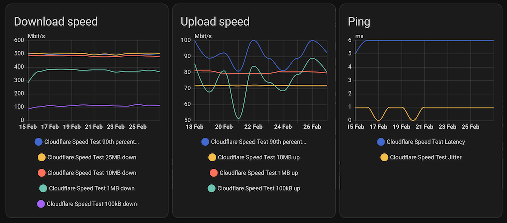

# Cloudflare Speed Test for Home Assistant

[](https://github.com/DigitallyRefined/ha-cloudflare-speed-test/actions/workflows/hassfest.yaml)
[](https://github.com/DigitallyRefined/ha-cloudflare-speed-test/actions/workflows/hacs_action.yml)
[](https://github.com/custom-components/hacs)


This integration uses the [cloudflarepycli](https://pypi.org/project/cloudflarepycli/) Python library to retrieve network performance statistics from [https://speed.cloudflare.com](https://speed.cloudflare.com) including:

* 90th percentile down/up
* 25MB down
* 10MB down/up
* 1MB down/up
* 100kB down/up
* Latency
* Jitter
* ISP
* IP address

It also attaches the test servers city, region and code to each result.

## Installation

### Using HACS  

If you dont' have [HACS](https://hacs.xyz) installed yet, I highly recommend it.  

[](https://my.home-assistant.io/redirect/hacs_repository/?owner=DigitallyRefined&repository=ha-cloudflare-speed-test&category=integration)  
Or search for `Cloudflare Speed Test` in HACS or copy this GitHub URL and add it as a custom integration repository.

### Manual  

[Download the latest `cloudflare_speed_test.zip` release](https://github.com/DigitallyRefined/ha-cloudflare-speed-test/releases) and extract it into your `<config>/custom_component` folder.

### Setup

After installation you need to **restart** Home Assistant before using this integration.

[](https://my.home-assistant.io/redirect/config_flow_start/?domain=cloudflare_speed_test)  
Or go to **Settings** -> **Devices & Services**  
Click **Add integration** and search for `Cloudflare Speed Test`

## Configuration

By default, a speed test will be run every hour. You can disable polling using system options and use the `update_entity` action to automate the speed test frequency.

If you want to define a specific interval at which your device is being polled for data, you can disable the default polling interval and create your own polling automation.

To add the automation:

1. Go to **Settings** > **Devices & services**, and select your integration.
2. On the integration entry, select the hamburger menu icon
   * Then, select **System options** and toggle the button to disable polling.
3. To define your custom polling interval, create an automation.
   1. Go to [**Settings** > **Automations & scenes**](https://my.home-assistant.io/redirect/automations) and create a new automation.
   2. Define any trigger and condition you like.
   3. Select **Add action**, then, select **Other actions**.
   4. Select **Perform action**, and from the list, select the [`homeassistant.update_entity` action](https://www.home-assistant.io/integrations/homeassistant/#action-homeassistantupdate_entity) (note: only select one entity, the other entities will be automatically updated).
4. Save your new automation to poll for data.

### Add to dashboard



To add graphs to your dashboard, the following YAML can be used:

<details>
<summary>Expand for dashboard YAML</summary>

```yaml
- chart_type: line
  period: day
  type: statistics-graph
  entities:
    - sensor.cloudflare_speed_test_90th_percentile_down
    - sensor.cloudflare_speed_test_25mb_down
    - sensor.cloudflare_speed_test_10mb_down
    - sensor.cloudflare_speed_test_1mb_down
    - sensor.cloudflare_speed_test_100kb_down
  stat_types:
    - max
  title: Download speed
- chart_type: line
  period: day
  type: statistics-graph
  entities:
    - sensor.cloudflare_speed_test_90th_percentile_up
    - sensor.cloudflare_speed_test_10mb_up
    - sensor.cloudflare_speed_test_1mb_up
    - sensor.cloudflare_speed_test_100kb_up
  stat_types:
    - max
  title: Upload speed
- chart_type: line
  period: day
  type: statistics-graph
  entities:
    - sensor.cloudflare_speed_test_latency
    - sensor.cloudflare_speed_test_jitter
  stat_types:
    - min
  title: Ping
```
</details>

## Notes

* When running on Raspberry Pi the maximum speed is limited by the LAN adapter. The Raspberry Pi 3+ models come with a Gigabit LAN adapter which supports a [maximum throughput](https://www.raspberrypi.org/products/raspberry-pi-3-model-b-plus/) of 300 Mbit/s.
* Running this integration can have negative effects on the system’s performance as it requires a fair amount of memory.
* If run frequently, this integration has the ability to use a considerable amount of data. Frequent updates should be avoided on bandwidth-capped connections.
* While a speed test is running your network capacity is fully utilized. This may have a negative effect on other devices using the network such as gaming consoles or streaming boxes.
* This integration and its author are **not** affiliated or associated with Cloudflare.

## Attribution

Original idea from [@rohankapoorcom, @engrbm87](https://github.com/home-assistant/core/tree/dev/homeassistant/components/speedtestdotnet)
